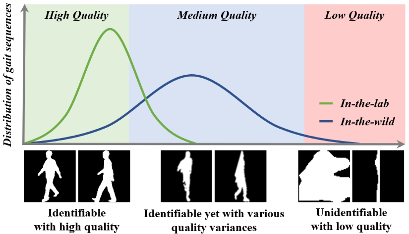
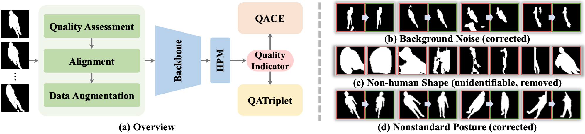
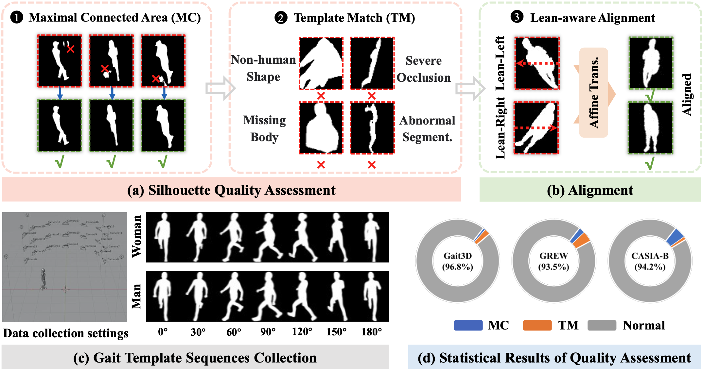
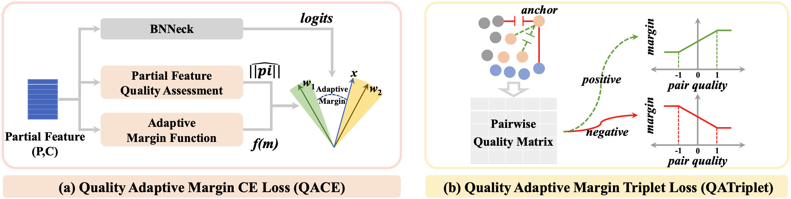

# QAGait

Official code for "[QAGait: Revisit Gait Recognition From a Quality Perspective](https://arxiv.org/pdf/2401.13531)" (AAAI 2024). 

<div align="left">
<a href="https://arxiv.org/pdf/2401.13531"></a>  &nbsp;&nbsp;
<a href="https://ojs.aaai.org/index.php/AAAI/article/view/28391"></a>  &nbsp;&nbsp;

</div>

------------------------------------------

## Motivation

<div align="center">
       
</div>

------------------------------------------

## Abstract

Gait recognition is a promising biometric method that aims to identify pedestrians from their unique walking patterns. Silhouette modality, renowned for its easy acquisition, simple structure, sparse representation, and convenient modeling, has been widely employed in controlled in-the-lab research. However, as gait recognition rapidly advances from in-the-lab to in-the-wild scenarios, various conditions raise significant challenges for silhouette modality, including 1) unidentifiable low-quality silhouettes (abnormal segmentation, severe occlusion, or even non-human shape), and 2) identifiable but challenging silhouettes (background noise, non-standard posture, slight occlusion). To address these challenges, we revisit gait recognition pipeline and approach gait recognition from a quality perspective, namely QAGait. Specifically, we propose a series of cost-effective quality assessment strategies, including Maxmial Connect Area and Template Match to eliminate background noises and unidentifiable silhouettes, Alignment strategy to handle non-standard postures. We also propose two quality-aware loss functions to integrate silhouette quality into optimization within the embedding space. Extensive experiments demonstrate our QAGait can guarantee both gait reliability and performance enhancement. Furthermore, our quality assessment strategies can seamlessly integrate with existing gait datasets, showcasing our superiority.

<div align="center">
       
</div>

------------------------------------------

## 0. Get Started
- clone this repo.
    ```
    git clone https://github.com/wzb-bupt/QAGait.git
    ```
- Install dependenices:
    - pytorch >= 1.10
    - torchvision
    - pyyaml
    - tensorboard
    - opencv-python
    - tqdm
    - py7zr
    - kornia
    - einops
  
    Install dependenices by [Anaconda](https://conda.io/projects/conda/en/latest/user-guide/install/index.html):
    ```
    conda install tqdm pyyaml tensorboard opencv kornia einops -c conda-forge
    conda install pytorch==1.10 torchvision -c pytorch
    ```    
    Or, Install dependenices by pip:
    ```
    pip install tqdm pyyaml tensorboard opencv-python kornia einops
    pip install torch==1.10 torchvision==0.11
    ```
- Prepare dataset: See [prepare dataset](datasets).

------------------------------------------

## 1. Unified Silhouette Quality Assessment (Quality-aware Pretreatment)

 - Including: Maximal Connect Area, Template Match, Alignment.
 - _Note_: It will take a few hours, depending on the CPU hardware and the SIZE of dataset. The following operations are implemented on 80 Intel(R) Xeon(R) Gold 6230 CPUs @ 2.10GHz.

<div align="center">
       
</div>

### >> QA-Gait3D ([pretreatment_log](datasets/QAGait-Pretreatment-Gait3D-2024-05-21-13-47-56.log)) 

- Gait3D-Silh. & QAGait3D: Require ~86GB storage space.

```
cd ./datasets
python qagait_pretreatment.py \
    -i /data/Gait3D/Silhouette/2D_Silhouettes \                      # <your dataset path>
    -o /data/Gait3D/Silhouette/QA-Gait3D \                           # <your output root>
    -template /data/Template/Template-frames-30-height-0-1-2-pkl/ \  # <your template path>
    -d Gait3D                                                        # <dataset name>
```

### >> QA-GREW ([pretreatment_log]())

- GREW-Silh. & QAGREW: Require ~ {TODO} GB storage space.

```
cd ./datasets
python qagait_pretreatment.py \
    -i /data/GREW/Silhouette/GREW-Sihouette \                        # <your dataset path>
    -o /data/GREW/Silhouette/QA-GREW \                               # <your output root>
    -template /data/Template/Template-frames-30-height-0-1-2-pkl/ \  # <your template path>
    -d GREW                                                          # <dataset name>
```

### >> QA-CASIA-B ([pretreatment_log](datasets/QAGait-Pretreatment-CASIA-B-2024-05-21-15-33-19.log))

- CASIA-B-Silh. & QACAISA-B: Require ~45GB storage space.

```
cd ./datasets
python qagait_pretreatment.py \
    -i /data/CASIA-B/Silhouette/GaitDatasetB-silh \                  # <your dataset path>
    -o /data/CASIA-B/Silhouette/QA-CASIA-B \                         # <your output root>
    -template /data/Template/Template-frames-30-height-0-1-2-pkl/ \  # <your template path>
    -d CASIA-B                                                       # <dataset name>
```

------------------------------------------

## 2. Quality-aware Feature Learning

 - QATriplet (Quality Adaptive Margin Triplet loss)
 - QACE (Quality Adaptive Margin CE loss)

<div align="center">
       
</div>

```
CUDA_VISIBLE_DEVICES=0,1,2,3,4,5,6,7 \
    python -m torch.distributed.launch \
    --nproc_per_node=8 \
    opengait/main.py \
    --cfgs ./configs/qagait/QAGait_QAGait3D_GaitBase.yaml \
    --phase train \
    --log_to_file
```

------------------------------------------

## 3. Citing Our Paper

If you find this codebase useful in your research, please consider citing:

    @article{wang2024qagait, 
        title={QAGait: Revisit Gait Recognition from a Quality Perspective}, 
        author={Wang, Zengbin and Hou, Saihui and Zhang, Man and Liu, Xu and Cao, Chunshui and Huang, Yongzhen and Li, Peipei and Xu, Shibiao}, 
        journal={Proceedings of the AAAI Conference on Artificial Intelligence}, 
        pages={5785-5793}, 
        volume={38}, 
        number={6}, 
        year={2024}, 
        month={Mar.}, 
        DOI={10.1609/aaai.v38i6.28391}, 
        url={https://ojs.aaai.org/index.php/AAAI/article/view/28391}, 
    }

## 4. Acknowledgement

Our code is built upon the great open-source project [OpenGait](https://github.com/ShiqiYu/OpenGait).